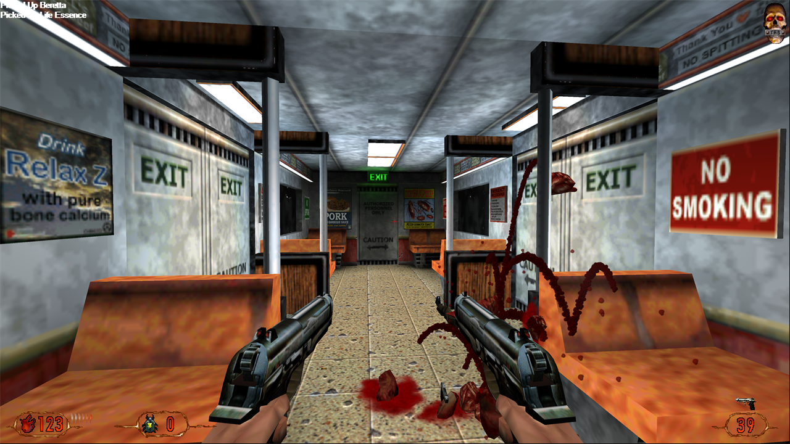

# d_ren - A Vulkan Renderer for LithTech 1



*Blood II: The Chosen, first level, rendered by d_ren (borderless fullscreen at 3840x2160, widescreen).*

d_ren is a drop-in replacement for LithTech 1's renderer DLLs (`d3d.ren`, `soft.ren`), written in D on top of Vulkan.
It started as a reverse-engineering prototype of the renderer interface. It now renders Blood II well enough to play:
levels load, and the world, characters, weapons, effects and the 2D interface all draw. It runs at 100+ fps at 4K.

Behaviour is ported from, and checked against, the original Blood II `d3d.ren`. The reference is a reconstruction of its
source plus side-by-side captures of the original running under dgVoodoo2. Where d3d.ren has quirks, d_ren reproduces
them by default (see *Fog* below).

## What it renders
- **World:** lightmaps (two-pass, including Blood II's `Saturate 1` doubling), pre-lit Gouraud surfaces, fullbright
  textures. Dynamic lights (muzzle flashes, explosions) light lightmapped walls per texel with d3d.ren's quadratic
  falloff, and Gouraud surfaces per vertex.
- **Cloud shadows:** outdoor levels with a panning sky move a cloud texture over the surfaces flagged for it.
- **Models:** animated characters and weapons (keyframe blending, per-vertex animation, hidden nodes), lit by the
  light grid, the camera-relative directional light and dynamic lights, with fullbright skins and the model hook.
  Chrome: weapons and props flagged for it get the level's environment map under their skin (high detail).
- **World models and containers** (doors, lifts, the train): lightmapped like the world when solid, blended when
  translucent.
- **Sprites:** billboards, glow sprites, z-biased and no-Z sprites, rotatable sprites, and decals clipped to their wall
  polygon.
- **Particle systems, polygrids** (water, with the environment-map pass) and **line systems**.
- **Sky:** sky objects seen through a sky camera that moves through the sky box with the player, behind the sky portals.
- **Surface effects:** the engine's scrolling, rotating and warbling textures (e.g. the tunnel seen from the train).
- **Screen flashes** (the camera's light add), **fog** (see below), and **the 2D layer** (menus, HUD, console, loading
  screens).
- Objects are drawn in the order of d3d.ren's object queues.

## Not done yet
- Model LOD (models are always drawn at full detail), the multiplayer skin tint pass, CoolFog, the screenshot key.
- Line systems are implemented but haven't been checked in-game yet.
- There is no visibility culling: the whole level is drawn every frame. It is still fast.

## Using it
1. Put `d_ren.ren` into the game folder. It's a single file with the shaders built in: unzip a release there, or let
   `build.ps1 -GameDir <folder>` copy it.
2. Select it in the game's launcher, or with `"RenderDLL" "d_ren.ren"` in `autoexec.cfg` / `++RenderDll d_ren.ren` on
   the command line.
3. Pick any resolution the game offers. d_ren runs borderless fullscreen on the primary monitor and renders 3D at the
   monitor's native resolution. The chosen mode only sets the size of the 2D interface, which is scaled up to fit.
   - With the game's `windowed 1` console variable it runs in a window of the mode's size instead.
   - Only modes up to 1000 pixels high are offered: the engine's own 2D code (the loading-screen warp) crashes above
     that, with any renderer.

Requirements:
- A GPU with Vulkan support, and the 32-bit Vulkan loader (`vulkan-1.dll` in `SysWOW64`, installed by the graphics
  driver).
- On current Windows, Blood II can crash at startup inside DirectInput (a heap overflow in its legacy HID path). That is
  unrelated to the renderer; [dinputto8](https://github.com/elishacloud/dinputto8) as `dinput.dll` in the game folder
  fixes it.

### Widescreen
Blood II sends a 4:3 field of view whatever the resolution, which stretches the 3D view on a wide screen. d3d.ren
stretches it the same way. d_ren keeps the vertical FOV and widens the horizontal one to the screen ("Hor+"). If the
game already sends a widescreen FOV (for example with a widescreen patch), nothing changes. The engine stretches 2D
images such as the loading screen before the renderer sees them, so those need game-side 16:9 art.

### Fog
Blood II levels turn fog on with ranges in world units (e.g. 700 to 2000). d3d.ren draws pre-transformed vertices, so
Direct3D compares those ranges with the 0..1 device depth, and in practice nothing gets fogged. d_ren matches that by
default. `d_FogMode 1` fogs by distance instead, as the level settings suggest was intended.

### Game speed
LithTech 1 steps the game simulation once per rendered frame, but never by less than 10 ms of game time
(`MIN_FRAMETIME` in the server, which in single player runs inside `CLIENT.EXE`). Above 100 fps the game therefore runs
fast: physics, AI and cutscenes at 2.4× speed at 240 fps. The original renderers have the same problem; the engine's
own `MaxFPS` setting stops at 200. With `d_GameSpeedFix 1` d_ren lowers that floor to 1 ms in memory (nothing on disk is
changed): the game runs at normal speed at 240 fps, measured from the server's own clock. If the game's code doesn't
match the expected Blood II 2.1 build, d_ren caps the frame rate at 100 fps instead. `vk_test.txt` logs the measured
game speed once a second.

### Mouse look
The engine spreads mouse movement over time and applies it per frame using `GetTickCount`, which only advances every
~15.6 ms. Above ~64 fps most frames therefore get no mouse movement and the next one gets a lump: at 240 fps the view
moved in only 64 of 240 frames (keyboard turning uses a different clock and was smooth). With `d_MouseFix 1` d_ren
points the engine's `GetTickCount` import at a 1 ms clock while the renderer is loaded, and the view follows the mouse
in every frame. The original import is restored when the renderer shuts down.

### Focus and the cursor
The engine pulls the cursor to the middle of its window every frame until it has been told it lost focus, which never
happens if the game starts behind another window: the cursor stays stuck in the middle of the screen. d_ren gives it the
two states of a modern game: with focus the cursor is hidden and held in the middle (mouse look needs that), without
focus it's visible and free. The game also asks for the foreground when it starts. Alt+Tab is still handled by the
engine, which unloads the renderer and loads it again on return.

### Modern lighting
`d_Lighting 1` replaces d3d.ren's dynamic-light formulas with per-pixel lighting. Muzzle flashes, explosions and the
levels' light effects then light the world, world models and characters per pixel with the surface's orientation
(N·L), with a smooth falloff and restrained specular highlights. Characters keep d3d.ren's light from the level's light
grid but without its 16 visible steps. The baked lightmaps and pre-lit colours are unchanged, and so is everything with
`d_Lighting 0` (the default for now). Lighting stays in gamma space like the original.

For comparisons, `d_Compare 1` draws the left half of the view the d3d.ren way and the right half with the current
settings. `d_DebugLight <radius>` adds a steady light just ahead of the camera, so the lighting can be checked anywhere.

### Console variables
d_ren's options are engine console variables. On first run they're created with their defaults and marked to be
saved, so after the game exits they appear in `autoexec.cfg`, where they can be edited. In the console, `name value`
changes an option for the current session only; `+name value` also saves it.

| Variable | Default | Meaning |
|---|---|---|
| `d_VSync` | 1 | 1: present in sync with the display (FIFO), paced to its refresh rate; 0: unsynchronised (MAILBOX, else IMMEDIATE). |
| `d_MaxFPS` | 0 | Frame cap; 0 = none (with `d_VSync 1`, the display's refresh rate). |
| `d_GameSpeedFix` | 1 | Keeps the game at normal speed above 100 fps (see *Game speed* above). |
| `d_MouseFix` | 1 | Smooth mouse look above ~64 fps (see *Mouse look* above). |
| `d_Widescreen` | 1 | Hor+ FOV correction; 0 projects the game's FOV as given, like d3d.ren. |
| `d_FogMode` | 0 | 0: fog like d3d.ren (device depth); 1: fog by eye distance. |
| `d_DebugClear` | 0 | 1 shows holes in the world in cornflower blue instead of black. |
| `d_GPU` | 0 | Which Vulkan adapter to use, by its index in the device list at the top of `vk_test.txt`. |
| `d_Lighting` | 0 | 1: per-pixel dynamic lights with N·L and specular (see *Modern lighting*). |
| `d_Specular` | 0.25 | Specular strength of the modern lighting; 0 turns it off. |
| `d_LightFalloff` | 1 | Exponent of the modern lighting's falloff `(1 - d²/r²)^n`; 1 is d3d.ren's lightmap curve, higher is softer. |
| `d_Compare` | 0 | 1: left half of the view as d3d.ren, right half with the current settings. |
| `d_DebugLight` | 0 | Radius of a test light ahead of the camera; 0 = none. |
| `d_ModelFlip`, `d_ModelVertexAnim` | 1 | Model diagnostics: the handedness flip and per-vertex animation. |
| `DrawSky`, `DrawSprites`, `DrawParticles`, `DrawPolyGrids`, `DrawLineSystems`, `LightAddPoly` | 1 | Turn object types off. |

The renderer also reads the game's own `FogEnable`, `FogNearZ`/`FogFarZ`, `FogR/G/B`, `SkyFogNearZ`/`SkyFogFarZ` and
`Saturate`, the same way d3d.ren does.

Logs: `vk_test.txt` (Vulkan setup; once a second: fps, object statistics, a per-stage frame time breakdown on the CPU
and per pass on the GPU, frame pacing, how often the camera moved, and the game speed) and `test.txt` (engine calls, a
once-a-second heartbeat, and any exception thrown inside the renderer). Both are in the game folder.

## Building
LithTech 1 is 32-bit only, so the renderer must be built as 32-bit. A 64-bit build fails one of the static asserts that
check the shared structure layouts.

Needs [LDC](https://github.com/ldc-developers/ldc) with the 32-bit (multilib) libraries, dub, and `glslang` (or the
Vulkan SDK's `glslangValidator`). `build.ps1` finds them under `-Toolchains` (default `D:\Prog\toolchains`) or on the
`PATH`:
```
.\build.ps1                                     # debug build
.\build.ps1 -Release -GameDir D:\Games\Blood2   # release build, deployed to the game folder
.\build.ps1 -Package                            # release build -> dist\d_ren-<version>.zip (renderer + install notes)
```
By hand: compile the six shaders (`shader`, `object` and `overlay`, `.vert`/`.frag`) to `vert.spv`/`frag.spv`,
`object_vert.spv`/`object_frag.spv` and `overlay_vert.spv`/`overlay_frag.spv` in the repository root (they're
embedded into the DLL), then run `dub build --arch=x86_mscoff --compiler=ldc2`. The `.ren` links druntime, Phobos and
the C runtime statically, so it has no runtime dependencies besides Windows and the Vulkan loader.

The version is set in `source/version_info.d`. When the Windows SDK's `rc.exe` is installed, `build.ps1` also puts it
into the DLL's file properties (dub configuration `versioned`).

## The Interesting Parts
- `source/renderer_interface.d` and `source/object/*.d` hold the renderer ABI. Anyone working with LithTech 1.0 should
  find them easy to translate to other C-like languages.
- `source/lt_objects.d`, `model_draw.d`, `world_model_draw.d` and `effects_draw.d` read the engine's object data and
  turn it into geometry.
- `source/memory.d` is the Vulkan memory allocator.

## Why Vulkan?
The original author knew Vulkan better than DirectX. Also, without hex-editing the original executable, an OpenGL
context can't be created in the window the engine provides.

Uses [ErupteD](https://github.com/ParticlePeter/ErupteD) as the binding.

## Observations
- Surfaces wider or taller than 5000 px can't be created: the engine checks that at Client.exe 0x0040b09a (file offset
  0xA492). Larger resolutions would need a patch there.
- The engine's 2D warp (used by the loading screen) has 1000-row tables. Modes taller than 1000 rows crash on level
  load, with d3d.ren too.
